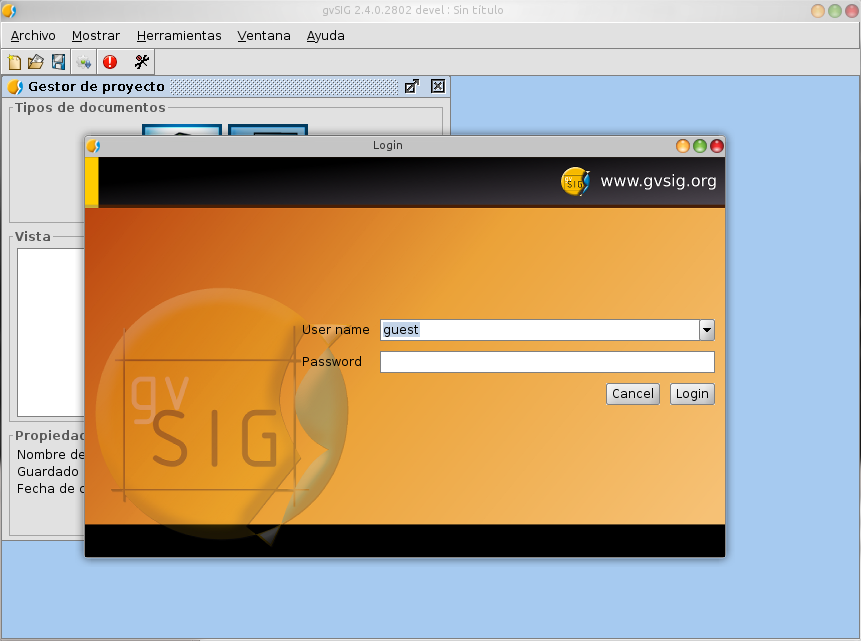
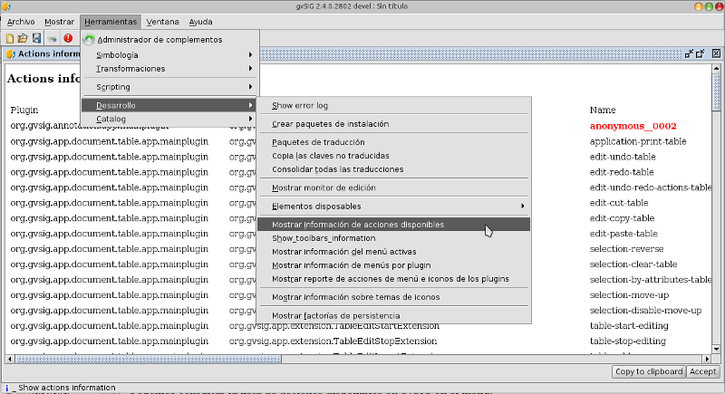
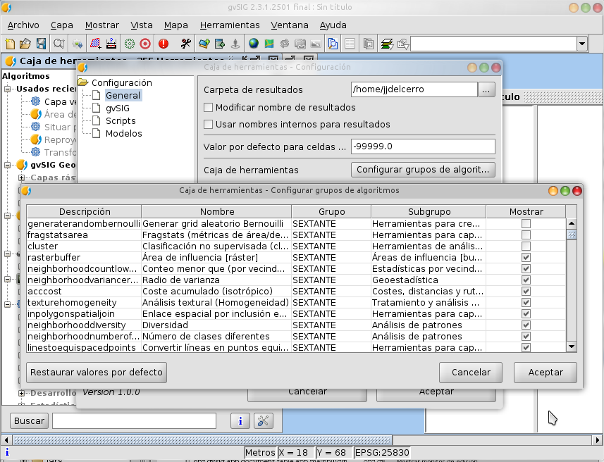

 
Descripcion
===============

Script de ejemplo de como implementar un gestor de permisos de usuario para gvSIG.

Implementa un gestor de permisos simple basado en ficheros *property* de java y un cuadro 
de dialogo de *login* que se muestra al inicio de la applicacion.

El gestor de permisos nos permite controlar:

- A que acciones tiene acceso un usuario, menus y barra de botones de gvSIG.
- A que fuentes de datos puede acceder un usuario, tanto para visualizacion como para modificacion.
- A que geoprocesos tiene acceso el usuario a traves del gestor de geoprocesos (requiere gvSIG 2.4).
- A que tipos de documento tiene acceso el usuario (tablas, vistas, mapas...)

   Inicio de sesion al iniciar gvSIG

Por defecto se han creado solo dos usuario:

- *guest*, clave en blanco, con acceso a todo gvSIG, no tiene 
  aplicada ninguna restriccion.
- *user01* con clave *user01*, que por defecto tiene restringido
  el acceso a la herramienta de informacion por punto y a la carga de shapes 
  que se llamen "country.shp", esten donde esten en el systema de ficheros.

Consideraciones de seguridad y rendimiento
=============================================

En un sistema de produccion donde se quiera restringir el acceso a las
acciones y recursos de gvSIG dentro de una organizacion en funcion del 
usuario, deberiamos considerar:

- El proceso de instalacion de gvSIG deberia proteger los archivos 
  de este script para que el usuario no pueda modificarlos o
  desactivarlo.

- En lugar de autenticar el usuario contra unos ficheros en el
  disco local, seria mas adecuado autenticarlo contra un servidor
  de dominio, LDAP o una base de datos centralizada, pidiendo
  a este los permisos que tiene el usuario en el momento de
  establecerse la sesion.

Tendremos que tener en cuenta que el metodo *isAuthorized* se invoca multitud
de veces, asi que tendremos especial cuidado de mantenerlo *ligero*. Es decir, 
no accederemos al servidor donde esten los permisos a cada vez que se le invoque.
Lo recomendado seria que en el momento de establecerse la sesion se carguen
los permisos del usuario en memoria y durante toda la sesion se usen esos
permisos.

Control de acceso a las acciones
==================================

Las acciones en gvSIG se utilizan para gestionar los menus y los
botones de la barra de botones de gvSIG. Antes de ejecutar una
accion se consulta con el gestor de identidades si el usuario corriente
tiene acceso a esa accion.

Podemos consultar la lista de acciones disponibles en gvSIG en el menu::

  Herramientas -> Desarrollo -> Mostrar informacion de acciones disponibles

   Listado de acciones disponibles en gvSIG

Utilizaremos la columna "Name" de la tabla como el nombre de la accion 
a la hora de restringir su acceso en los permisos del usuario.

Control de acceso a los geoprocesos
=====================================

Tambien se puede restringir el acceso que tiene el usuario a los geoprocesos
de gvSIG. Cuando el *Gestor de geoprocesos* se carga, consulta que proceso
esta activo para el usuario corriente invocando a *isAuthorized* con el 
nombre de accion *access-geoprocess*, como recurso indica el objeto *algoritmo*
o *ToolboxAction*, y como nombre de recurso el identificador del geoproceso.

Podemos consultar los identificadores de los geoprocesos si desde el *Gestor de
geoprocesos* accedemos a la *Configuracion de la caja de herramientas* y alli 
consultamos *Configurar grupos de algoritmos*. Nos mostrara una tabla con los
algoritmos disponibles, y su primera columna (Descripcion) es lo que 
recibiremos en *isAuthorized* commo nombre de recurso.

   Listado de geoprocesos disponibles en gvSIG
